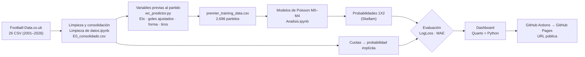

# 1. Panorama del proyecto

[← Índice](README.md) · [Siguiente: contexto y datos →](02_contexto_y_datos.md)

## Resumen

Las casas de apuestas publican **cuotas** para cada partido, y de una cuota se puede deducir una
**probabilidad** (si la cuota de que gane el local es 2.00, el mercado le asigna ≈ 50 %). Nos
preguntamos si **un modelo estadístico con información pública previa al partido** puede
anticipar el resultado tan bien como esas cuotas.

Construimos un modelo con **dos regresiones de Poisson**, una para los goles del local y otra
para los del visitante, con variables calculadas **solo con partidos anteriores**: diferencia de
**Elo** (fuerza), **goles a favor y en contra ajustados** y, en versiones más grandes, **forma
reciente** y **tiros**. De los goles esperados salen las probabilidades de victoria local,
empate y victoria visitante (el "1X2").

Lo entrenamos con 2019/20–2023/24, elegimos entre cinco versiones con 2024/25 y lo evaluamos
con partidos que el modelo nunca vio (agosto 2025 a septiembre 2026).

**Resultado:** el modelo más simple (M0, 3 variables) acierta el 48 % de los partidos, contra 41.5 %
de "siempre gana el local", y logra el **84 %** de la mejora que consiguen las cuotas sobre una
referencia ingenua. Pero **no supera al mercado**. Más variables no ayudaron fuera de muestra.
**Conclusión:** las cuotas ya incorporan la información estadística pública, y más (alineaciones,
lesiones, noticias).

## El flujo completo

## Quién hizo qué

| Parte | Integrantes | Entregables |
|---|---|---|
| Código | Dani y Edu | `Limpieza de datos.ipynb`, `wc_predictor.py`, `Analisis.ipynb`, reporte técnico en LaTeX |
| Dashboard/página | César y Max | Tablero en Quarto, repositorio público y publicación en GitHub Pages |
| Reporte | Fer y Erika | Reporte breve que se envía por correo |

## Dónde está cada cosa

| Archivo | Qué es | Explicado en |
|---|---|---|
| `Codigo/proyecto_mod_8/Limpieza de datos.ipynb` | Une los 26 CSV en una sola tabla | [Cap. 3](03_limpieza_de_datos.md) |
| `Codigo/proyecto_mod_8/E0_consolidado.csv` | La base: 9,450 partidos × 33 variables | [Cap. 2](02_contexto_y_datos.md) |
| `Codigo/proyecto_mod_8/wc_predictor.py` | Funciones de Elo, forma reciente y promedios ajustados | [Cap. 10](10_codigo_wc_predictor.md) |
| `Codigo/proyecto_mod_8/premier_training_data.csv` | Caché: variables previas de cada partido desde 2019 | [Cap. 11](11_codigo_analisis_notebook.md) |
| `Codigo/proyecto_mod_8/Analisis.ipynb` | Entrena y evalúa M0–M4 y compara con el mercado | [Cap. 11](11_codigo_analisis_notebook.md) |
| `Codigo/Documentacion/main.tex` / `Modulo_8.pdf` | Reporte técnico del modelo | [Cap. 12](12_resultados.md) |
| `Dashboard-o-pagina/index.qmd` | El tablero: páginas, textos y orden | [Cap. 13](13_dashboard.md) |
| `Dashboard-o-pagina/datos_dashboard.py` | Calcula todas las cifras del tablero | [Cap. 13](13_dashboard.md) |
| `Dashboard-o-pagina/graficas.py` | Hace las gráficas | [Cap. 13](13_dashboard.md) |
| `.github/workflows/publicar-dashboard.yml` | Publica el tablero en cada `git push` | [Cap. 14](14_publicacion_en_github.md) |

## Cómo se cumple lo que piden las instrucciones

| Etapa pedida | Qué hicimos | Capítulo |
|---|---|---|
| Selección y obtención de datos | Premier League, Football-Data, 26 temporadas, descarga directa (sin API) | 2 |
| Exploración | Auditoría de calidad; localía; favorito; Elo vs resultado; calibración; distribución de goles | 2, 12 |
| Limpieza y transformación | Consolidación, fechas, orden cronológico; variables previas al partido | 3, 4, 5 |
| Pregunta de investigación | Pregunta, hipótesis, variable objetivo, población, unidad, periodo y alcance | 2 |
| Análisis exploratorio | Páginas "¿Qué ocurre?" y "Patrones" del tablero | 12, 13 |
| Modelado | Regresión de Poisson (5 especificaciones), partición temporal, métricas, comparación contra referencias | 6, 7, 9, 11 |
| Visualización publicada con URL | Dashboard en GitHub Pages | 13, 14 |
| Repositorio reproducible | Repositorio público con código, datos, instrucciones y construcción automática | 14 |
| Reporte | Lo arma el equipo de Reporte con esta misma información | 12, 18 |
