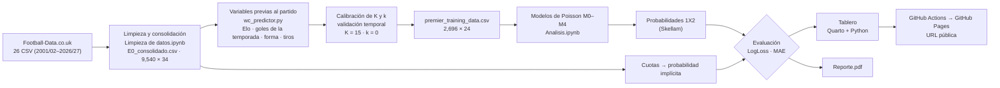

# 1. Panorama del proyecto

[← Índice](README.md) · [Siguiente: contexto y datos →](02_contexto_y_datos.md)

## Resumen

Las casas de apuestas publican **cuotas** para cada partido, y de una cuota se puede deducir una
**probabilidad** (si la cuota de que gane el local es 2.00, el mercado le asigna ≈ 50 %). Nos
preguntamos si **un modelo estadístico con información pública previa al partido** puede
anticipar el resultado tan bien como esas cuotas.

Construimos un modelo con **dos regresiones de Poisson**, una para los goles del local y otra
para los del visitante, con variables calculadas **solo con partidos anteriores**: diferencia de
**Elo** (fuerza), **promedios de goles a favor y en contra de la temporada** y, en versiones más
grandes, **forma reciente** y **tiros**. De los goles esperados salen las probabilidades de victoria
local, empate y victoria visitante (el "1X2").

Dos parámetros de esas variables no se fijaron a mano: la **K del Elo** y la **k del *shrinkage***
se eligieron por **validación temporal** dentro del periodo de entrenamiento. Ganaron **K = 15** y
**k = 0** (con k = 0, el promedio es simplemente el de la temporada en curso).

Lo entrenamos con 2019/20–2023/24 (1,897 partidos), comparamos cinco versiones con 2024/25 (380) y
lo evaluamos con partidos que el modelo nunca vio (419, de agosto de 2025 a septiembre de 2026).

**Resultado:** el modelo más simple (M0, 3 variables) acierta el **48.0 %** de los partidos de
prueba, contra 41.5 % de "siempre gana el local", y logra el **80 %** de la mejora que consiguen las
cuotas sobre una referencia ingenua (83 % en validación). Pero **no supera al mercado**: su LogLoss
es 1.033 contra 1.020. Más variables no mejoran de forma pareja: en validación el mejor LogLoss es
el de M4, por un margen mínimo; en prueba vuelve a ganar M0 (y M3 tiene el menor error de goles).
**Conclusión:** las estadísticas públicas sí informan, pero las cuotas ya incorporan esa información
y más (alineaciones, lesiones, noticias).

## Las cifras finales

| Qué | Cifra |
|---|---|
| Base histórica | **9,540 partidos × 34 columnas**, del 18-ago-2001 al 14-sep-2026: 25 temporadas completas de 380 partidos y 40 de 2026/27 |
| Base de modelación | **2,696 × 24**: 1,897 entrenamiento · 380 validación · 419 prueba |
| Parámetros calibrados | **K = 15** (Elo), **k = 0** (promedios); LogLoss medio 0.959558 en 2021/22–2023/24 (con la configuración anterior, K = 30 y k = 10: 0.962178) |
| LogLoss en prueba | M0 **1.033** · mercado de apertura **1.020** · referencia ingenua 1.087 · azar 1.099 |
| LogLoss en validación | M0 0.990 · M4 0.979 · mercado 0.971 |
| Aciertos en prueba | M0 **48.0 %** · mercado 48.9 % · "siempre gana el local" 41.5 % |
| Parte de la ventaja del mercado que logra M0 | **80 %** en prueba · 83 % en validación |
| Brecha M0 − mercado (bootstrap, IC 95 %) | prueba +0.0131 [−0.0005, +0.0264]: no concluyente por muy poco · validación + prueba +0.0159 [+0.0064, +0.0255]: el mercado es mejor |
| M4 − M0 (bootstrap, IC 95 %) | validación −0.0109 [−0.0213, −0.0001]: M4 mejor por un margen mínimo · prueba +0.0037 [−0.0063, +0.0139]: no concluyente |
| Ejemplo | Arsenal–Man City con M0: **43.65 % / 25.00 % / 31.35 %**, marcador más probable **1–1** (11.80 %) |
| Verificación del tablero | 17 de 17 cifras coinciden con las salidas guardadas del notebook |

Las explicaciones y las tablas completas están en el [capítulo 12](12_resultados.md).

## Dos formas de plantear la pregunta

El tablero y el reporte entregado formulan la investigación desde ángulos distintos. Los datos, los
modelos y las cifras son los mismos.

| | Tablero y README | Reporte (`Reporte.pdf`, §2.1–§2.2) |
|---|---|---|
| **Pregunta** | ¿Qué tan bien anticipan el resultado de un partido de la Premier League (gana el local, empate o gana el visitante) las estadísticas disponibles antes del encuentro, frente a las probabilidades implícitas en las cuotas de apuestas? | ¿En qué medida la incorporación de variables históricas de fortaleza y desempeño reciente mejora la capacidad predictiva de un modelo probabilístico de resultados de partidos de la Premier League, y cómo se compara su desempeño con las probabilidades implícitas en las cuotas de apertura? |
| **Lo que compara primero** | El modelo contra el **mercado** (referencia externa) | M0 contra los modelos **ampliados** M1–M4 (comparación interna) |
| **Hipótesis** | Las estadísticas sí contienen información útil, pero el mercado, que además tiene información ventajosa, la aprovecha mejor | Los modelos ampliados tendrán menor error de goles y mejores probabilidades 1X2 |
| **Respuesta** | Se confirma: M0 supera a la referencia ingenua (diferencia de LogLoss −0.0537, IC 95 % [−0.0861, −0.0217]) pero no al mercado | Se respalda **parcialmente**: en validación M4 tiene el menor LogLoss (0.978612) y M0 el menor MAE (0.918332); en prueba M0 el menor LogLoss (1.033076) y M3 el menor MAE (0.894173). El mercado es mejor en ambos periodos |

**Cómo se concilian.** La pregunta del reporte es una de las preguntas secundarias del tablero
("¿más variables mejoran el pronóstico?"), y las dos comparten la comparación con el mercado. Las
respuestas encajan en una sola historia: (1) las estadísticas informan, porque M0 le gana a la
referencia ingenua; (2) agregar variables no mejora de forma pareja, porque depende de la métrica y
del periodo; (3) el mercado sigue siendo mejor que cualquiera de los cinco modelos.

**Si preguntan por qué difieren:** "Es la misma investigación vista desde dos lados. El tablero
pregunta qué tan cerca del mercado llega un modelo con estadísticas; el reporte, cuánto ayudan las
variables adicionales. Los números son los mismos y las conclusiones son compatibles: las variables
extra no mejoran de forma uniforme y nadie supera al mercado." En la exposición conviene enunciar la
del tablero y decir que el reporte desarrolla a fondo la comparación entre especificaciones
([capítulo 20](20_el_reporte_entregado.md)).

## El flujo completo


```mermaid
flowchart LR
  A["Football-Data.co.uk<br/>26 CSV (2001/02–2026/27)"] --> B["Limpieza y consolidación<br/>Limpieza de datos.ipynb<br/>E0_consolidado.csv · 9,540 × 34"]
  B --> C["Variables previas al partido<br/>wc_predictor.py<br/>Elo · goles de la temporada · forma · tiros"]
  C --> K["Calibración de K y k<br/>validación temporal<br/>K = 15 · k = 0"]
  K --> D["premier_training_data.csv<br/>2,696 × 24"]
  D --> E["Modelos de Poisson M0–M4<br/>Analisis.ipynb"]
  E --> F["Probabilidades 1X2<br/>(Skellam)"]
  B --> G["Cuotas → probabilidad implícita"]
  F --> H{"Evaluación<br/>LogLoss · MAE"}
  G --> H
  H --> I["Tablero<br/>Quarto + Python"]
  H --> R["Reporte.pdf"]
  I --> J["GitHub Actions → GitHub Pages<br/>URL pública"]
```

### La cadena de archivos

Como la describe el README del repositorio, cada etapa toma lo que produjo la anterior:

```text
Datos crudos (Football-Data.co.uk, 26 archivos E0.csv)
      │  Codigo/proyecto_mod_8/Limpieza de datos.ipynb
      ▼
E0_consolidado.csv          9,540 partidos, del 18/08/2001 al 14/09/2026
      │  Codigo/proyecto_mod_8/Analisis.ipynb (usa wc_predictor.py)
      ▼
premier_training_data.csv   2,696 partidos, del 09/08/2019 al 14/09/2026
+ modelos M0–M4, validación, prueba y comparación con el mercado
      │  Dashboard-o-pagina/ (Quarto + datos_dashboard.py + graficas.py)
      ▼
Dashboard-o-pagina/_site/index.html   el tablero que se publica en GitHub Pages
```

Aparte, el reporte técnico está en `Reporte.pdf`, en la raíz del repositorio. El tablero no copia
cifras a mano: `datos_dashboard.py` lee K, k y la escala del Elo de `wc_predictor.py`, la ventana,
el decaimiento, las rejillas y los pliegues del código de `Analisis.ipynb`, y compara sus resultados
con las salidas guardadas del notebook.

## Quién hizo qué

| Parte | Integrantes | Entregables |
|---|---|---|
| Código | Dani y Edu | `Limpieza de datos.ipynb`, `wc_predictor.py`, `Analisis.ipynb` (incluida la calibración de K y k) |
| Dashboard/página | César y Max | Tablero en Quarto, repositorio público, publicación en GitHub Pages y README del repositorio |
| Reporte | Fer y Erika | Reporte técnico final (`Reporte.pdf`, 21 páginas) |


## Cómo llegamos a la versión entregada

| Fecha (2026) | Qué pasó |
|---|---|
| 22 de septiembre | Primera versión completa: Elo con K = 30 y promedios con k = 10 fijados a mano; base de 9,450 partidos × 33 columnas. Se publica el tablero y se escribe esta guía. |
| 29–30 de septiembre | El equipo de Código rehace la limpieza (9,540 × 34: ya no se pierden 90 partidos de 2003/04 y 2004/05), calibra K y k por validación temporal (K = 15, k = 0) y renumera el notebook (la calibración es la nueva §5). El equipo decide mantener K = 15 y k = 0. |
| 30 de septiembre | El tablero pasa a leer K, k y los resultados del código y del notebook (commit `9f84684`). El notebook agrega la nota de los 4 partidos excluidos y evalúa también M3 en prueba. Se reescribe el README (reproducibilidad paso a paso con huellas SHA-256), se sube `Reporte.pdf` y se borra `Codigo/Documentacion/`. El README documenta una reproducción completa desde cero ese día (Linux, Python 3.10.20, Quarto 1.8.25). Último commit: `e3bd43f` "Correcciones finales". |

Cada `push` a `main` volvió a publicar el tablero con GitHub Actions ([capítulo 14](14_publicacion_en_github.md)).

## Dónde está cada cosa

Los 18 archivos del repositorio entregado (rama `main`, commit `e3bd43f`):

| Archivo | Qué es | Explicado en |
|---|---|---|
| `Codigo/proyecto_mod_8/Limpieza de datos.ipynb` | Une los 26 CSV de Football-Data en una sola tabla (28 celdas) | [Cap. 3](03_limpieza_de_datos.md) |
| `Codigo/proyecto_mod_8/E0_consolidado.csv` | La base histórica: 9,540 partidos × 34 variables, de 2026/27 hacia atrás | [Cap. 2](02_contexto_y_datos.md) y [3](03_limpieza_de_datos.md) |
| `Codigo/proyecto_mod_8/wc_predictor.py` | Elo, promedios de temporada (con *shrinkage*) y forma reciente; también funciones heurísticas que el análisis no usa | [Cap. 10](10_codigo_wc_predictor.md) |
| `Codigo/proyecto_mod_8/Analisis.ipynb` | 26 celdas: §1–§10 y "Alcance, supuestos y reproducibilidad"; calibra K y k, entrena y evalúa M0–M4 y compara con el mercado | [Cap. 11](11_codigo_analisis_notebook.md) |
| `Codigo/proyecto_mod_8/premier_training_data.csv` | Base de variables previas al partido: 2,696 × 24 (exportada desde el notebook) | [Cap. 2](02_contexto_y_datos.md) y [11](11_codigo_analisis_notebook.md) |
| `Dashboard-o-pagina/_quarto.yml` | Configuración del sitio: qué se renderiza (`index.qmd`), carpeta de salida `_site`, idioma y ejecución sin mostrar código | [Cap. 13c](13c_codigo_index_quarto.md) |
| `Dashboard-o-pagina/index.qmd` | El tablero: páginas, textos, tarjetas y orden | [Cap. 13c](13c_codigo_index_quarto.md) |
| `Dashboard-o-pagina/datos_dashboard.py` | Calcula todas las cifras del tablero | [Cap. 13a](13a_codigo_datos_dashboard.md) |
| `Dashboard-o-pagina/graficas.py` | Hace las gráficas (Plotly) | [Cap. 13b](13b_codigo_graficas.md) |
| `Dashboard-o-pagina/estilos.scss` | Colores, tipografía y estilos del tablero | [Cap. 13](13_dashboard.md) |
| `Dashboard-o-pagina/redibujar.html` | Pequeño script (JavaScript) que vuelve a dibujar las gráficas de Plotly al cargar la página, cuando una pestaña oculta se hace visible o cuando una gráfica cambia mucho de tamaño | [Cap. 13c](13c_codigo_index_quarto.md) |
| `Dashboard-o-pagina/requirements.txt` | Versiones fijas de los paquetes de Python | [Cap. 14](14_publicacion_en_github.md) |
| `Dashboard-o-pagina/README.md` y `Dashboard-o-pagina/.gitignore` | Instrucciones del tablero; archivos generados que no se suben (`_site/`, …) | [Cap. 13](13_dashboard.md) y [14](14_publicacion_en_github.md) |
| `.github/workflows/publicar-dashboard.yml` | GitHub Actions: renderiza y publica el tablero en cada `push` a `main` | [Cap. 14](14_publicacion_en_github.md) |
| `README.md` | Estructura, cadena de archivos, reproducibilidad paso a paso con huellas SHA-256, versiones, cómo repetir la rejilla de K y k, uso de IA | [Cap. 14](14_publicacion_en_github.md) y [3, §3.7](03_limpieza_de_datos.md#37-reconstruir-la-base-desde-cero) |
| `.gitignore` | Archivos que no se suben (generados, del sistema, `ProyectoModulo8.pdf`) | [Cap. 14](14_publicacion_en_github.md) |
| `Reporte.pdf` | Reporte técnico final (21 páginas) | [Cap. 20](20_el_reporte_entregado.md) |

Ya **no existen** en el repositorio: `Codigo/Documentacion/` (el LaTeX y el PDF del reporte
anterior) y `REPRODUCIBILIDAD.txt` (su contenido pasó al README). El archivo `ProyectoModulo8.pdf`
(las instrucciones del proyecto) está en la carpeta local, pero el `.gitignore` lo excluye.

## Mapa de la guía

| # | Capítulo | Qué cubre |
|---|---|---|
| 1 | Panorama (este) | La historia en una página, cifras finales, las dos formulaciones de la pregunta, archivos |
| 2 | [Contexto, pregunta y datos](02_contexto_y_datos.md) | Apuestas 1X2, pregunta e hipótesis, Football-Data, diccionarios de las dos bases, decisiones sobre los datos, calidad |
| 3 | [Limpieza de datos](03_limpieza_de_datos.md) | El notebook de limpieza celda por celda (0 a 27), con su versión en R y sus decisiones |
| 4 | [Elo](04_elo.md) | Fórmula, ejemplo a mano, K = 15 y la escala de 400 |
| 5 | [Promedios de temporada y forma reciente](05_promedios_ajustados_y_forma.md) | *Shrinkage* (k = 0) y promedio ponderado (0.85) con ejemplos |
| 6 | [Poisson y regresión de Poisson](06_poisson_y_regresion.md) | Distribución de Poisson, GLM, enlace logarítmico, interpretación de coeficientes |
| 7 | [De goles esperados a probabilidades](07_de_goles_a_probabilidades.md) | Independencia, matriz de marcadores, Skellam |
| 8 | [Cuotas y mercado](08_cuotas_y_mercado.md) | Probabilidad implícita, margen, normalización, apertura y cierre |
| 9 | [Evaluación y validación](09_evaluacion_y_validacion.md) | Partición temporal, calibración de K y k, LogLoss, MAE, bootstrap, VIF |
| 10 | [Código: `wc_predictor.py`](10_codigo_wc_predictor.md) | Cada función, qué se usa y qué no, equivalente en R |
| 11 | [Código: `Analisis.ipynb`](11_codigo_analisis_notebook.md) | Cada celda del notebook, equivalente en R |
| 12 | [Resultados](12_resultados.md) | Todas las tablas y cómo leerlas |
| 13 | [El dashboard](13_dashboard.md) | Diseño del tablero: historia, indicadores, color |
| 13a | [Código: `datos_dashboard.py`](13a_codigo_datos_dashboard.md) | Cada función que calcula las cifras del tablero |
| 13b | [Código: `graficas.py`](13b_codigo_graficas.md) | Cada gráfica de Plotly y su equivalente en R |
| 13c | [Código: `index.qmd` y Quarto](13c_codigo_index_quarto.md) | La página: estructura, expresiones en línea, configuración |
| 14 | [Publicación en GitHub](14_publicacion_en_github.md) | Git, GitHub Actions y Pages, paso a paso |
| 15 | [Limitaciones y extensiones](15_limitaciones_y_extensiones.md) | Qué no hace el modelo y cómo mejorarlo |
| 16 | [Guion de la exposición](16_guion_exposicion.md) | 5 minutos cronometrados |
| 17 | [Banco de preguntas](17_banco_de_preguntas.md) | Preguntas probables con respuesta |
| 18 | [Hallazgos y pendientes](18_hallazgos_y_pendientes.md) | Detalles del código y del reporte |
| 19 | [Decisiones y alternativas](19_decisiones_y_alternativas.md) | Todas las decisiones del proyecto, con alternativas y justificación |
| 20 | [El reporte entregado](20_el_reporte_entregado.md) | Qué dice `Reporte.pdf` y en qué difiere del tablero |
| — | [Glosario](glosario.md) | Todos los términos, en una línea |

## Cómo se cumple lo que piden las instrucciones

| Etapa pedida | Qué hicimos | Capítulo |
|---|---|---|
| Selección y obtención de datos | Premier League, Football-Data, 26 temporadas, descarga directa (sin API) | 2 |
| Exploración | Auditoría de calidad; localía; favorito; Elo contra resultado; calibración; distribución de goles | 2, 12 |
| Limpieza y transformación | Consolidación sin perder partidos, 9 revisiones de consistencia, fechas, tipos; variables previas al partido | 3, 4, 5 |
| Pregunta de investigación | Pregunta, hipótesis, variable objetivo, población, unidad, periodo y alcance (en sus dos formulaciones) | 1, 2 |
| Análisis exploratorio | Páginas "¿Qué ocurre?" y "Patrones" del tablero | 12, 13 |
| Modelado | Regresión de Poisson (5 especificaciones), K y k calibrados, partición temporal, métricas, comparación contra referencias | 6, 7, 9, 11 |
| Visualización publicada con URL | Tablero en GitHub Pages | 13, 13a–13c, 14 |
| Repositorio reproducible | Repositorio público con código, datos, README con huellas SHA-256 y construcción automática | 3, 14 |
| Reporte | `Reporte.pdf` en la raíz del repositorio | 20 |
| Justificación de decisiones | Cada decisión con sus alternativas | 19 |
